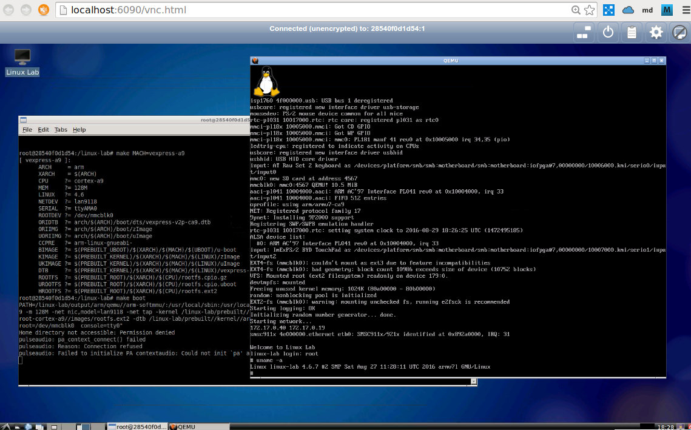

# Linux Lab

This project aims to make a Qemu-based Linux development Lab to easier the learning and development of the [Linux Kernel](http://www.kernel.org).

A full Chinese document is added: [Using Linux Lab to do embedded linux development](http://tinylab.org/using-linux-lab-to-do-embedded-linux-development/).

For Linux 0.11, please try our [Linux 0.11 Lab](http://github.com/tinyclub/linux-0.11-lab).

## Homepage

    See: <http://tinylab.org/linux-lab/>

## Download the lab

    $ git clone https://github.com/tinyclub/cloud-lab.git
    $ cd cloud-lab/ && tools/docker/choose linux-lab

    $ tools/docker/build # Build ourselves
    or
    $ tools/docker/pull # Pull from docker hub

    $ tools/docker/identify
    $ tools/docker/run

For Ubuntu 12.04, please install the new kernel at first, otherwise, docker will not work:

    $ sudo apt-get install linux-generic-lts-trusty

## Quickstart

Login the VNC page via `tools/open-docker-lab.sh` with the password printed in
the console, and then open the 'Linux Lab' desktop shortcut on the desktop to
launch into the Lab, and issue the following command to boot the prebuilt
kernel and rootfs on the default versatilepb board:

    $ make boot

**Notes**

If the screen size doesn't fit your display, set the scaling mode via the setting button on the top right side, or just modify the `-screen 0 1720x960x16` of `tools/supervisord.conf` to your own. the second method need to rerun `tools/install-docker-lab.sh` and `tools/run-docker-lab-daemon.h`.

## Usage

Check supported boards:

    $ make list
    [ pc ]:
          ARCH     = x86
          CPU     ?= i686
          LINUX   ?= 4.6
          ROOTDEV ?= /dev/ram0
    [ g3beige ]:
          ARCH     = powerpc
          CPU     ?= generic
          LINUX   ?= 4.6
          ROOTDEV ?= /dev/ram0
    [ vexpress-a9 ]:
          ARCH     = arm
          CPU     ?= cortex-a9
          LINUX   ?= 4.6
          ROOTDEV ?= /dev/mmcblk0
    [ malta ]:
          ARCH     = mips
          CPU     ?= mips32r2
          LINUX   ?= 4.6
          ROOTDEV ?= /dev/ram0
    [ versatilepb ]:
          ARCH     = arm
          CPU     ?= arm926t
          LINUX   ?= 4.6
          ROOTDEV ?= /dev/ram0

Check the board specific configuration:

    $ cat boards/versatilepb/Makefile

Download the sources:

    $ make core-source -j3     # All in one

    $ make kernel-source       # One by one 
    $ make root-source

Checkout/Configure the sources:

    $ make checkout         # Without uboot
    $ make config           # Configure all with defconfig, without uboot

    $ make kernel-checkout  # Checkout the specific version, *Please make sure changes are saved before do it!*
    $ make kernel-defconfig # Configure one by one
    $ make root-defconfig

    $ make kernel-defconfig

Manually configure the sources:

    $ make kernel-menuconfig
    $ make root-menuconfig

Build them:

    $ make build   # All in one without uboot

    $ make kernel  # One by one
    $ make root

    $ make kernel KP=0  # Disable kernel patch action

    $ make kernel-modules # Build internel kernel modules, Must ensure CONFIG_MODULES=y
    $ make kernel-modules-install
    $ make root-rebuild && make boot

    $ make kernel-modules M=/path/to/kernel/modules XKM=1 # External kernel modules, By default, examples/ldt/

    $ make kernel-modules XKM=0  # No external kernel modules
    $ make kernel-modules KM=0   # No kernel modules

Boot it:

    $ make boot     # Boot with graphic

    $ make boot G=0  # Boot with serial port (no graphic), exit with 'CTRL+a x' or 'pkill qemu'

    $ make boot PBK=0 PBD=0 PBR=0 # Disable prebuilt kernel, dtb and rootfs

    $ make boot U=1  # Boot with Uboot

Boot with different rootfs:

    $ make boot ROOTDEV=/dev/ram    # default
    $ make boot ROOTDEV=/dev/nfs
    $ make boot ROOTDEV=/dev/sda
    $ make boot ROOTDEV=/dev/mmcblk0

Debug it:

    Compile the kernel with CONFIG_DEBUG_INFO=y and boot it:

    $ make BOARD=malta boot DEBUG=1

    Open a new terminal:

    $ gdb output/mipsel/linux-4.6-malta/vmlinux
    (gdb) target remote :1234
    (gdb) b kernel_entry
    (gdb) b start_kernel
    (gdb) c

Save your changes:

    $ make save         # Save all of the configs and rootfs/kernel/dtb images

    $ make kconfig-save # Save configs to boards/BOARD/, kernel config
    $ make rconfig-save # rootfs config

    $ make root-save    # Save images to prebuilt/
    $ make kernel-save

If NFS boot fails, please make sure `IP_PNP` and `ROOT_NFS` are configured in
kernel and if issue still exists, then try to fix up it:

    $ tools/restart-net-servers.sh

By default, the default board: 'versatilepb' is used, we can configure, build
and boot for a specific board with 'BOARD', for example:

    $ make BOARD=malta
    $ make root-defconfig
    $ make root
    $ make kernel-checkout
    $ make kernel-defconfig
    $ make kernel
    $ make boot U=0

To transfer files between Qemu Board and Host, three methods are supported by
default:

* The first one is simply put the files with a relative path in `system/`

    $ cd system/
    $ mkdir system/root/
    $ touch system/root/new_file
    $ make root-install
    $ make root-rebuild
    $ make boot G=1

* Another is `/dev/nfs`, this need to boot the board with `ROOTDEV=/dev/nfs`

    Boot/Qemu Board:

        $ make boot ROOTDEV=/dev/nfs

    Host:

        $ make env | grep ROOTDIR
	ROOTDIR = /linux-lab/prebuilt/root/mipsel/mips32r2/rootfs

* The last one is use tftp server of host from the Qemu board with the `tftp` command.

    Host:

        $ ifconfig br0
        inet addr:172.17.0.3  Bcast:172.17.255.255  Mask:255.255.0.0
        $ cd tftpboot/
        $ ls tftpboot
        kft.patch kft.log

    Qemu Board:

        $ ls
        kft_data.log
        $ tftp -g -r kft.patch 172.17.0.3
        $ tftp -p -r kft.log -l kft_data.log 172.17.0.3

    Note: while put file from Qemu board to host, must create an empty file in host firstly. Buggy?

## More

Buildroot has provided many examples about buildroot and kernel configuration:

* buildroot: `configs/qemu_ARCH_BOARD_defconfig`
* kernel: `board/qemu/ARCH-BOARD/linux-VERSION.config`

To start a new ARCH, BOARD and linux VERSION test, please based on it.

Note, different qemu version uses different kernel VERSION, so, to find the
suitable kernel version, we can checkout different git tags.
